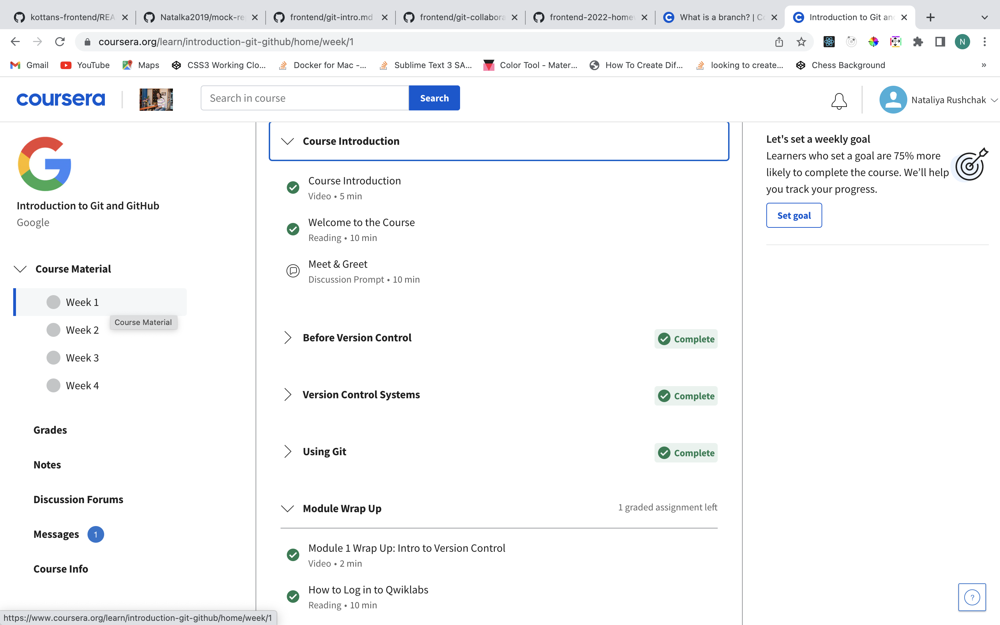
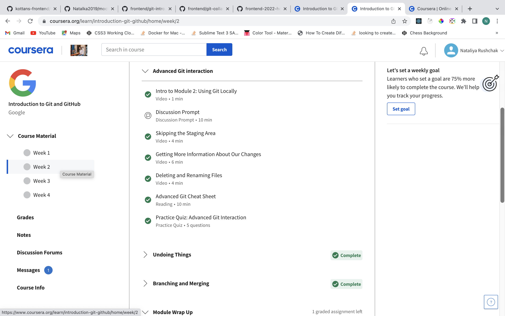
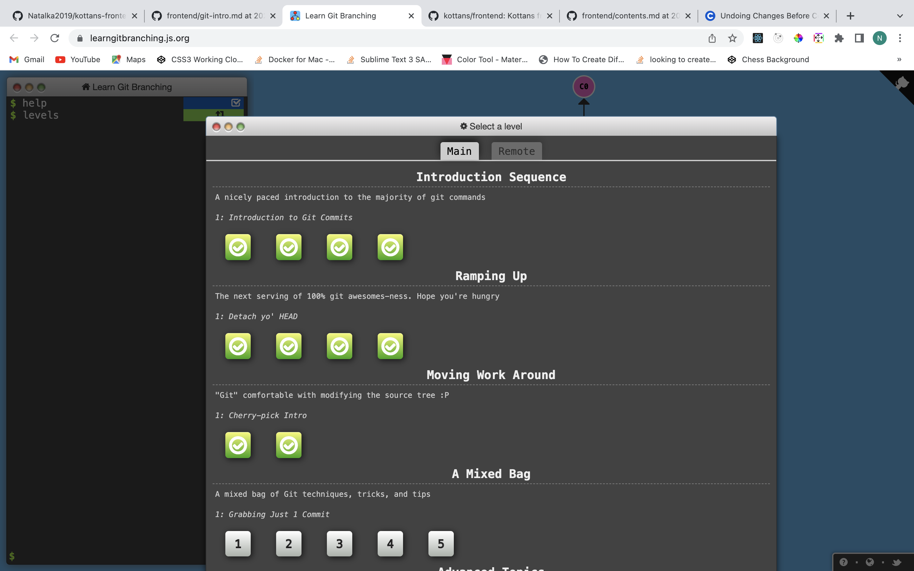
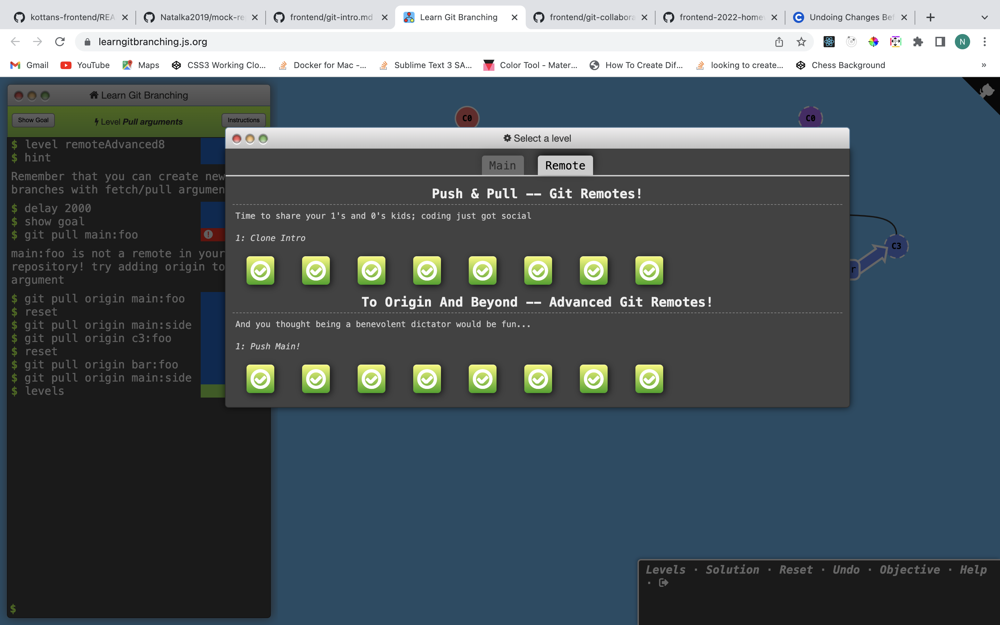
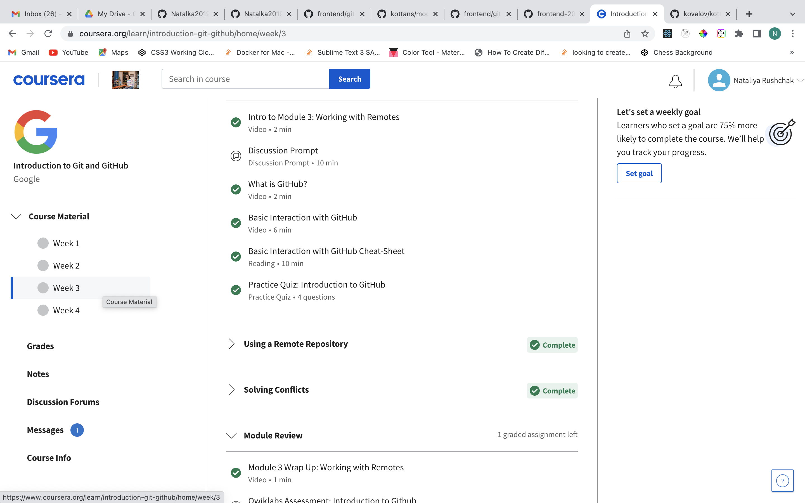
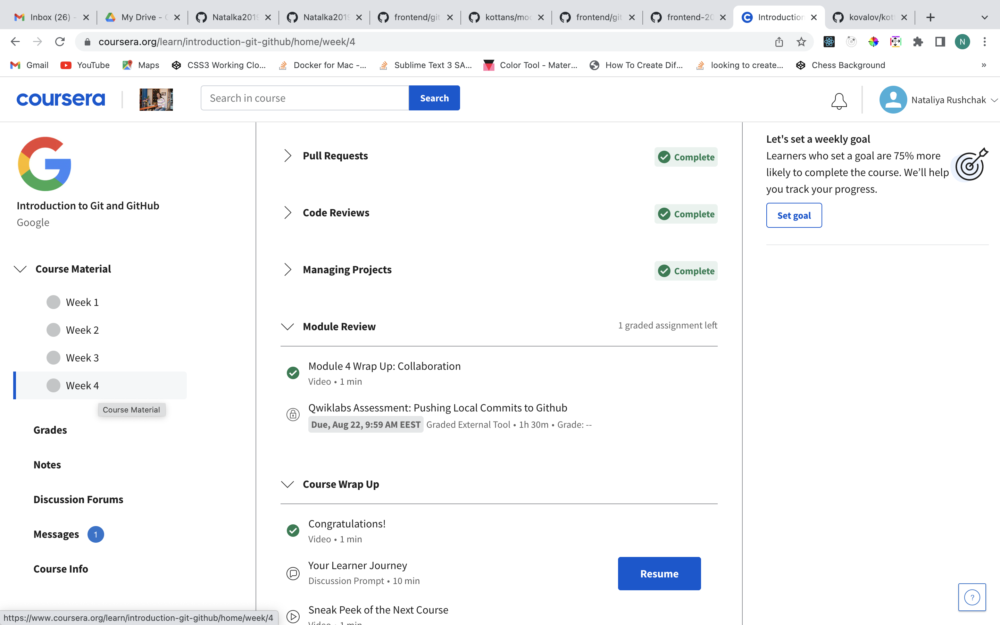

Learning with [Kottans Front-End Course](https://github.com/kottans/frontend) :palm_tree: :sunny: :tropical_drink:

### 0. Git Basics

[Notes](task_git_basics/README.md)

Screenshots

### 1. Linux CLI and Networking

### 2. VCS (hello gitty), GitHub and Collaboration

Screenshots

### 3. Intro to HTML & CSS
