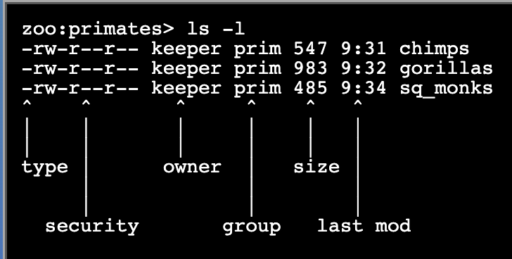
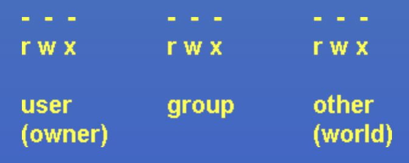
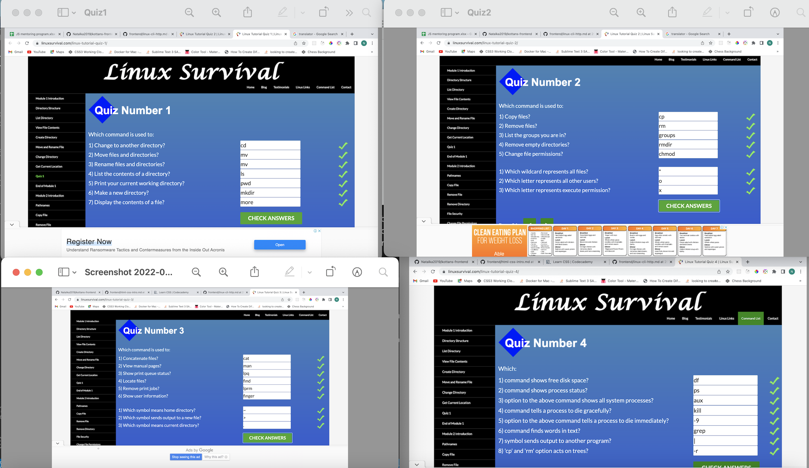
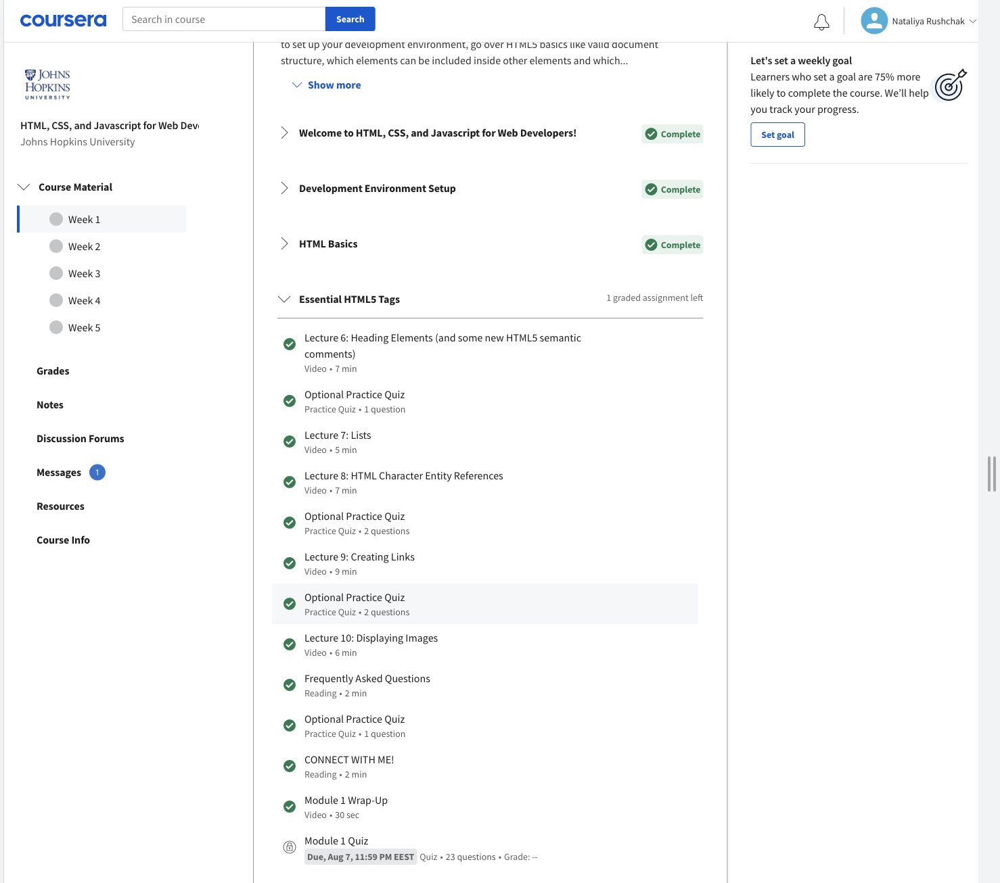
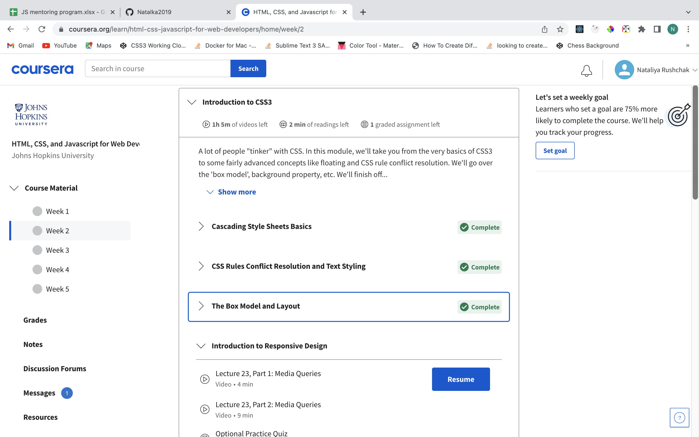
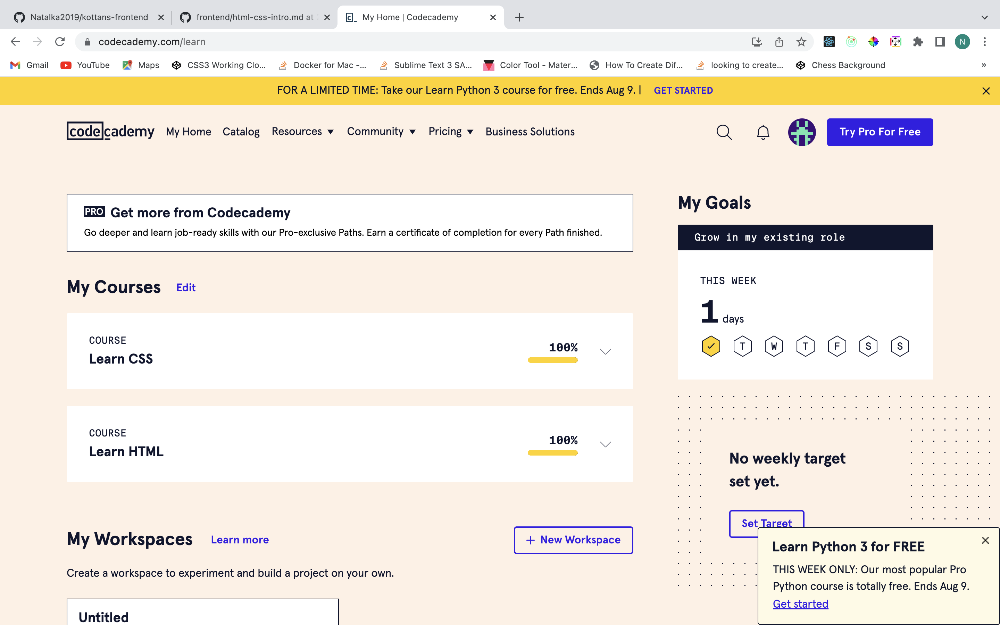
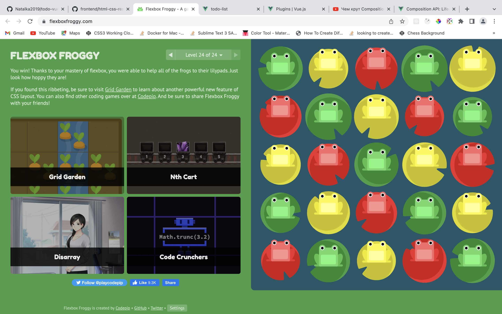
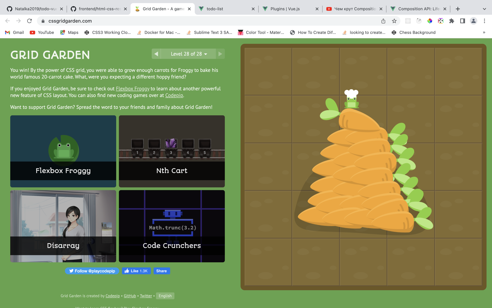

Learning with [Kottans Front-End Course](https://github.com/kottans/frontend) :palm_tree: :sunny: :tropical_drink:

### 0. Git Basics

<details>
<summary>Notes</summary>

`a` - added, `c` - changed  
`git log` - review the commit history  
`git log -p` - review the commit history with details of changes  
`git show commitId` - info about commit and associated patch  
`git config -l` - to look at config  
`checkout` (for unstaged "undos") and `reset` (for staged "undos") are generally used for making local or private 'undos'. `revert` is considered a safe operation for 'public undos' as it creates new history which can be shared remotely and doesn't overwrite history remote team members may be dependent on.  
`git commit --amend` - allows us to modify and add changes to the **most recent** commit. Avoid for public commits as would create mess.
`git merge --abort` - If there are merge conflicts (meaning files are incompatible), --abort can be used to abort the merge action.  
`git branch -r` - lists remote branches

</details>

<details>
<summary>Screenshots</summary>


</details>

### 1. Linux CLI and Networking

<details>
<summary>Linux notes</summary>

`ls` - list content of directory in alphabetical order  
`ls -l` - long list

1.  `-` - file or `d` - directory
2.  9 characters related to security divided on 3 sets (user(owner), group, other(world)) of 3 permissions (rwx)
    `r` - read file  
     `w` - write/modify file  
     `x` - execute file. This permission is given only if file is a program  
     `-` - permission revoked (відкликаний)
3.  owner
4.  group owner
5.  size of the file in bytes
6.  time the file was last modified
7.  filename

  <details>
  <summary>Screenshots</summary>





  </details>

`chmod` - change mode  
 `chmod o+x FileName`
`o` - other (could be u (user) or g(group))  
 `+` - add permission  
 `x` - execute (could be r(read) or w(wright))  
 `*` - wildcard, matches any number of characters, so file name `*` matches all the files in the directory
`?` - wildcard, matches exactly one character (s?n)  
`groups` - listing of current user group memberships

`more FileName` - view content of a file. Hit the spacebar to see next page of file content  
`mkdir DirectoryName` - make directory.  
`mv FileName TargetDirectoryName` - Move file into directory  
`mv OldFileName NewFileName` - rename file  
`cd TargetDirectory` - change directory to target directory  
`pwd` - print working directory (to find out where you are)  
`cd ..` - change directory to previous directory  
`cp OriginalFileName CopiedFileName` - copy file  
`cp -r` - copy directory  
`rm` - remove file  
`rmdir` - remove empty directory  
`rm -r` - remove directory tree  
`/` - root directory

`~` - home directory  
`man -k Keyword` - search command that has Keyword somewhere  
`find -name "Name"`  
`cat` - concatenate  
`>` - where you want output of concatenation go. over-writes existing file  
`>>` - appends to existing file

`lpr` - send to default printer (line printer)  
`lpq` - display print queue  
`lprm` - remove from print queue

`df` - disc free. "Used" and "Available" columns do not add up to the "1k-blocks" (total) column. That is because a percentage of the disk is always set aside for administrative use. In this case, 5% of each disk is reserved.

`ps aux` - process status  
`|` - pipe, sends the output of a command as the input to another command  
`grep` - file for a particular pattern of characters

</details>

<details>
<summary>HTTP notes</summary>

Every request raised by the browser is **independent**. The HTTP protocol is **stateless**. That means that each individual request needs to carry all the information needed to fulfill it (through headers).  
The requests are sent, and responses are received over the **TCP/IP layer**. The default port for HTTP communication is **port 80**, but this can be configured differently for different applications. A TCP stream is broken into IP packets, and it ensures that those packets always arrive in the correct order without fail. HTTP is an application layer protocol over TCP, which is over IP.
HTTPS is a secure version of HTTP, inserting an additional layer between HTTP and TCP called TLS or SSL (Transport Layer Security or **Secure Sockets Layer**, respectively). HTTPS communicates over **port 443** by default.
HTTPS uses the Secure Sockets Layer (SSL) or Transport Layer Security (TLS) to encrypt the entire communication between the client and the server. This makes sure that the client is connected only to the right server. Also, it verifies that the data is transferred only to the intended server.  
When a client makes a request over HTTPS, it first tries to locate a certificate on the server. If the cert is found, it attempts to verify it against its known list of CAs. If it's not one of the listed CAs, it might show a dialog to the user warning about the website's certificate. Once the certificate is verified, the SSL handshake is complete, and secure transmission is in effect.
An HTTP connection is identified by source-IP, source-port and destination-IP, destination-port.
Steps:

- resolve IP address from host name via DNS
- establish a connection with the server
- send a request
- wait for a response
- close connection
  HTTP/1.1 introduced persistent connections, long-lived connections that stay open until the client closes them.  
  browsers/clients also employ a technique, called parallel connections, to minimize network delays.  
  2.0 - multiple requests with one connection
  HTTP request parts:
  1. Request line: verb, path, HTTP version (GET /articles/http-basics HTTP/1.1)
  2. Headers
  3. Body  
     HTTP response parts:
  4. Status line: includes a status code that indicates whether the request succeeded (status code 200) or why the request failed. It also includes the HTTP version and a very brief description of the status. (HTTP/1.1 200 OK)
  5. Headers
  6. Body

</details>

<details>
<summary>Screenshots</summary>



</details>

### 2. VCS (hello gitty), GitHub and Collaboration

<details>
<summary>Screenshots</summary>


</details>

### 3. Intro to HTML & CSS

<details>
<summary>Notes</summary>

Horizontal margins do not collapse. Vertical margins collapse.

`position: relative` The element is positioned according to the normal flow of the document, and then offset **relative to itself** based on the values of top, right, bottom, and left. The offset **does not affect the position of any other elements**; thus, the **space** given for the element **in the page layout is the same** as if position were static.  
`position: absolute` The element is **removed from the normal document flow**, and no space is created for the element in the page layout. It is positioned **relative to its closest positioned ancestor**, if any; otherwise, it is placed relative to the initial containing block. Its final position is determined by the values of top, right, bottom, and left.  
`position: fixed` The element is **removed from the normal document flow**, and no space is created for the element in the page layout. It is positioned **relative to the initial containing block** established by the viewport.

CSS Specificity: 0,0,0,0 (inline style, id, class/pseudo-class/attribute, elements reference)

`div, p` Selects all **div** elements and all **p** elements  
`div p` Selects all **p** elements inside **div** elements  
`div > p` Selects all **p** elements where the direct parent is a **div** element  
`div + p` Selects the first **p** element that is placed immediately after **div** elements  
`p ~ ul` Selects every **ul** element that is preceded by a **p** element

`colspan` attribute to span columns  
`rowspan` attribute to span rows

`<datalist>` contains a set of `<option>` elements and works with an `<input>` to search through choices. Setting type to "list" will pair the `<input>` with a `<datalist>` element if the id of both are the same.

```
img[src*='winter'] {
  height: 50px;
}
```

`serif` and `sans-serif` are keyword values that can be added as a final fallback font if nothing else in the font stack is available.

</details>    
<details>
<summary>Screenshots</summary>







</details>

### 4. Responsive Web Design

<details>
<summary>Notes</summary>

`<meta name="viewport" content="width=device-width, initial-scale=1">`  
`width=device-width` sets the width of the viewport to the width of the device.  
`initial-scale=1` sets the initial zoom level when the user visits the page.

```
img {
  max-width: 100%;
  display: block;
}
```

Use the `width` and `height` attributes on your  tag. This is because modern browsers will use this information to **reserve space** for the image before it loads in, this will help to avoid layout shifts as content loads.

`<link rel="stylesheet" href="print.css" media="print">`

Header, body, footer:

```
.wrapper {
  flex-direction: column;
  justify-content: space-between;
}
```

```
.wrapper {
  flex-direction: column;
}
.main {
  flex: 1 1 auto; //flex-grow (0 - no grow allowed), flex-shrink (0 - no shrink allowed)
}
```

Create space of 16px between columns in flex container:

```
.flex_row {
  margin: 0 -8px;
}
.flex_columns_inside_row {
  padding: 0 8px;
}
```

</details>
<details>
<summary>Screenshots</summary>





</details>

### 5. HTML & CSS Practice

<details>
<summary>Notes</summary>

```
.visually-hidden {
  position: absolute;
  width: 1px;
  height: 1px;
  margin: -1px;
  border: 0;
  padding: 0;
  overflow: hidden;
  clip: rect(0 0 0 0);
}
```

</details>

 | 

### 6. JavaScript Basics

<details>
<summary>Notes</summary>

**Recursive functions** must have a base case when they return without calling the function again (in this example, when n <= 0), otherwise they can never finish executing.

</details>
<details>
<summary>Screenshots</summary>

<!-- 

 -->

</details>