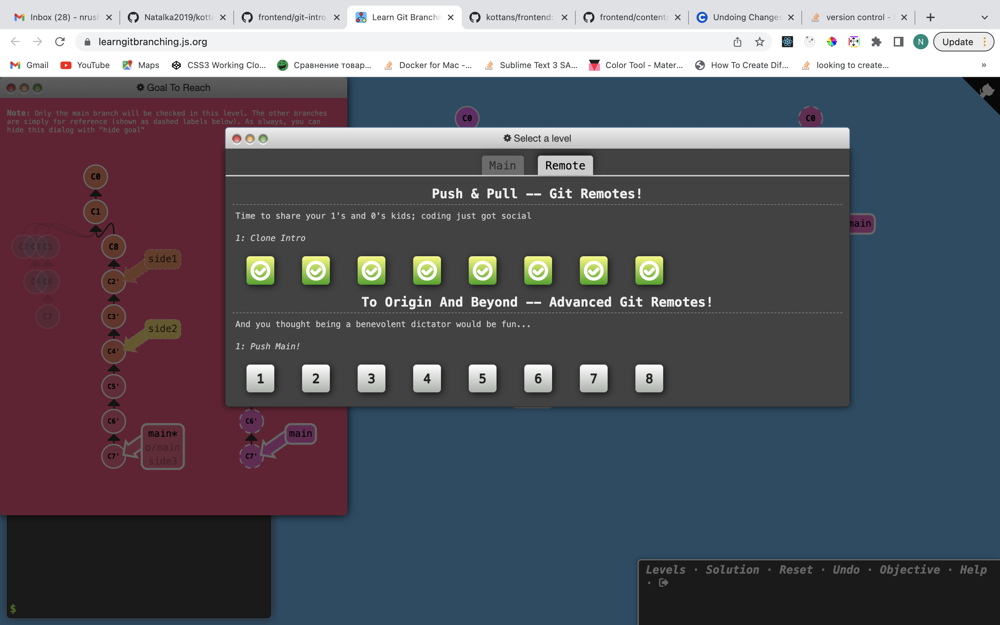
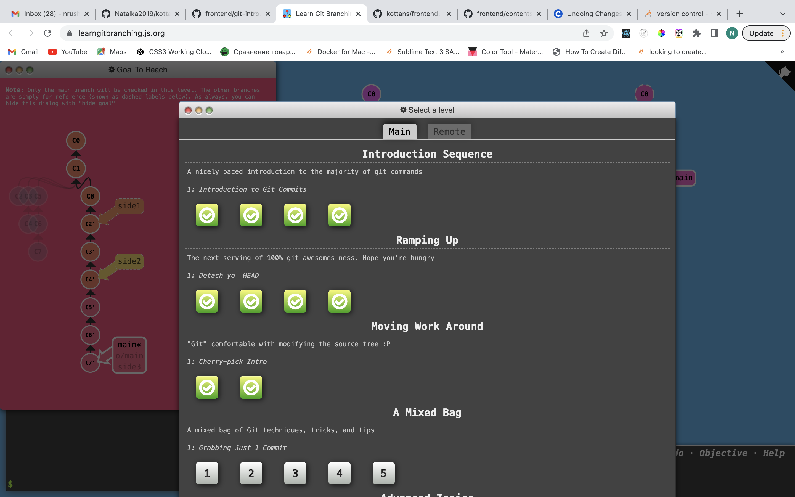

Learning with [Kottans Front-End Course](https://github.com/kottans/frontend)

### Git Basics

:palm_tree: _Notes_

`diff` file1 file2 - find difference between 2 files (`diff -u` file1 file2 - to find lines which differ in two files)  
`<` - line was deleted  
`>` - line was added  
`a` - added, `c` - changed  
`git log` - review the commit history  
`git log -p` - review the commit history with details of changes  
`git show commitId` - info about commit and associated patch  
`git config -l` - to look at config  
`checkout` and `reset` are generally used for making local or private 'undos'. They modify the history of a repository that can cause conflicts when pushing to remote shared repositories. `revert` is considered a safe operation for 'public undos' as it creates new history which can be shared remotely and doesn't overwrite history remote team members may be dependent on.

- [ ] 1. Linux CLI and Networking  
     :sunny: Notes  
     :zap: Screenshot

- [ ] 2. VCS (hello gitty), GitHub and Collaboration  
     :sunny: Notes  
     :zap: Screenshot
