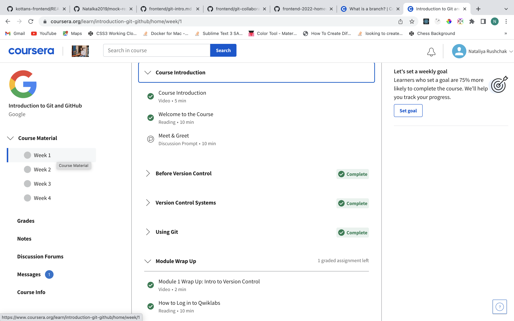
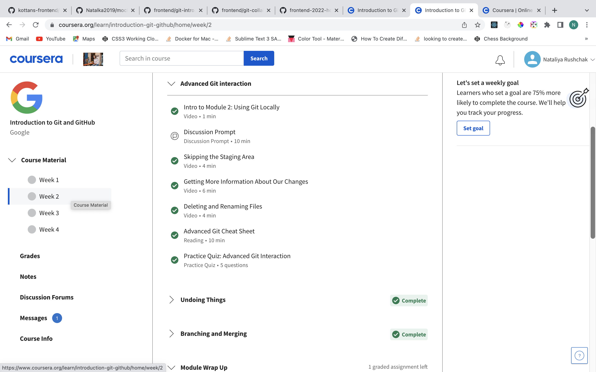
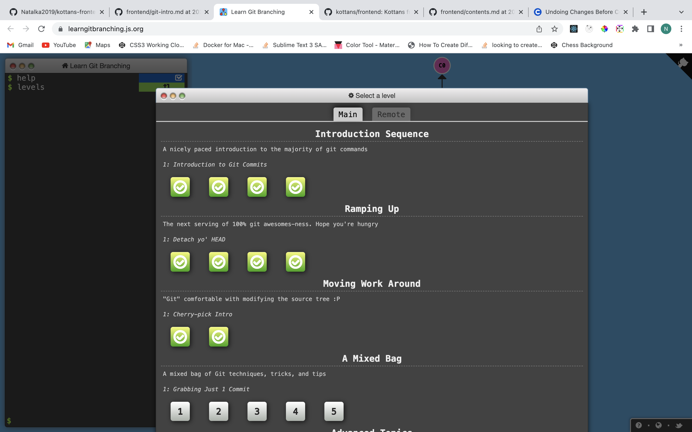
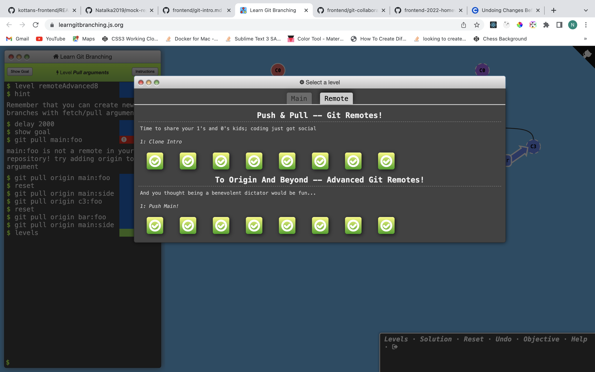

Learning with [Kottans Front-End Course](https://github.com/kottans/frontend)

- [x] 0. Git Basics  
     :palm_tree: [Notes](git_basics/README.md)

     
Screenshot: Introduction to Git and GitHub - week 1

     

     
Screenshot: Introduction to Git and GitHub - week 2

 
     :zap: 

     
Screenshot: git main tab test results

     :tropical_drink: 

     
Screenshot: git remote tab test results

     :tropical_drink: 

- [ ] 1. Linux CLI and Networking  
     :sunny: Notes  
     :zap: Screenshot

- [ ] 2.  VCS (hello gitty), GitHub and Collaboration
      

           
Screenshot: Introduction to Git and GitHub - week 3

           

     
Screenshot: Introduction to Git and GitHub - week 2

 
     :zap: 

- [ ] 3.  Intro to HTML & CSS  
      :sunny: Notes  
      :zap: Screenshot
